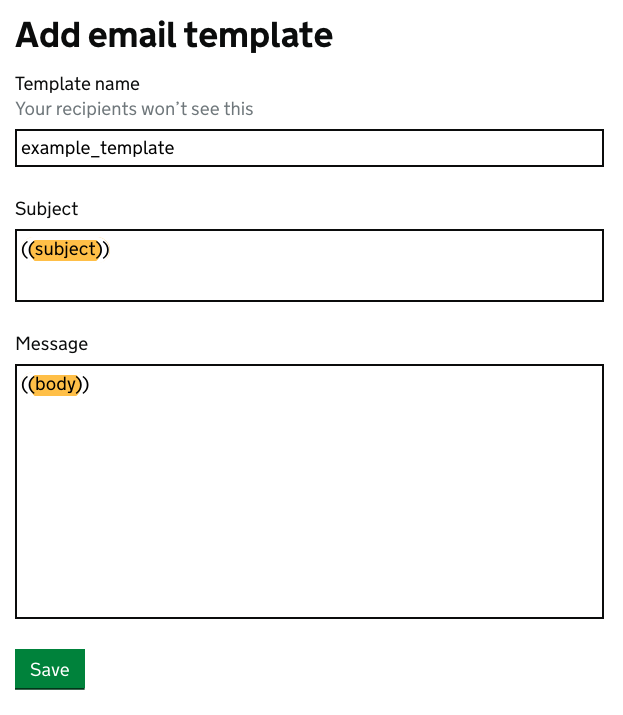

[](https://github.com/dxw/mail-notify/actions)
[](https://coveralls.io/github/pezholio/mail-notify)
[](https://rubygems.org/gems/mail-notify)
[](https://mit-license.org/)

# Mail::Notify

Rails / ActionMailer support for the [GOV.UK Notify API](https://www.notifications.service.gov.uk).

## Installation

Add this line to your application's Gemfile:

```ruby
gem 'mail-notify'
```

And then execute:

    $ bundle

Or install it yourself as:

    $ gem install mail-notify

Then, add the following to your `config/environments/*.rb` (where * is `test`, `development`, `production` or whatever other environment(s) you have) file(s):

```ruby
config.action_mailer.delivery_method = :notify
config.action_mailer.notify_settings = {
  api_key: YOUR_NOTIFY_API_KEY
}
```

If you're using a different Notify service to GOV.UK Notify (for example [GOV.CA Notify](https://notification.alpha.canada.ca/)), you can also specify the Base URL in your setup:

```ruby
config.action_mailer.delivery_method = :notify
config.action_mailer.notify_settings = {
  api_key: YOUR_NOTIFY_API_KEY,
  base_url: 'https://api.notification.alpha.canada.ca'
}
```

### Mailers

There are two options for using `Mail::Notify`, either templating in Rails with a view, or templating in Notify. Whichever way you choose, you'll need your mailers to inherit from `Mail::Notify::Mailer` like so:

```ruby
class MyMailer < Mail::Notify::Mailer
end
```

#### With a view

Out of the box, Notify offers support for templating, with some rudimentary logic included. If you'd rather have your templating logic included with your source code for ease of access, or you want to do some more complex logic that's not supported by Notify, you can template your mailer views in erb.

For this to work with Notify, you'll need a very simple template set up in Notify, with a `((subject))` variable in the subject line, and a `((body))` variable in the body field, as below:



Next, in your mailer you'll need to call `view_mail` with the first parameter being the ID of the notify template, followed by a hash of email headers e.g:

```ruby
class MyMailer < Mail::Notify::Mailer
    def send_email
        view_mail('YOUR_TEMPLATE_ID_GOES_HERE',
          to: 'mail@somewhere.com',
          subject: 'Subject line goes here'
        )
    end
end
```

Your view can then be a simple `text.erb` file. You can add some markdown for headers, bullet points and links etc. These are handled in the same way as standard action_mailer views.

#### With Notify templating

You can also send your customisations in the more traditional way, and do your templating in Notify if you prefer. For this, you'll need to call `template_mail`, again with the first parameter being the ID of the template, and a hash of email headers, including your personalisations, e.g:

```ruby
class MyMailer < Mail::Notify::Mailer
    def send_email
        template_mail('YOUR_TEMPLATE_ID_GOES_HERE',
          to: 'mail@somewhere.com',
          personalisation: {
              foo: 'bar'
          }
        )
    end
end
```

By default, any blank personalisation are removed from the request, which will trigger mail template validation. This is to avoid accidental blanks in the email. If you want to send a blank value, you need to explicitly state that the personalization can be blank:  

```ruby
class MyMailer < Mail::Notify::Mailer
  def send_email
    template_mail('YOUR_TEMPLATE_ID_GOES_HERE',
                  to: 'mail@somewhere.com',
                  personalisation: {
                    foo: foo.name, # This will trigger template validation error when blank
                    bar: blank_allowed(bar.name) # This will inject empty string in the template when blank
                  }
    )
  end
end
```


#### With optional Notify arguments

It's possible to pass two optional arguments to Notify:

- `reply_to_id`: This is an email reply-to address specified by you to receive replies from your users
- `reference`: A unique identifier you can create if necessary. This reference identifies a single unique notification or a batch of notifications

More information can be [found in the docs](https://docs.notifications.service.gov.uk/ruby.html#send-an-email-arguments-personalisation-optional)

```ruby
class MyMailer < Mail::Notify::Mailer
    def send_email
        view_mail('YOUR_TEMPLATE_ID_GOES_HERE',
          to: 'mail@somewhere.com',
          subject: 'Subject line goes here',
          reply_to_id: 'YOUR_REPLY_TO_ID_GOES_HERE',
          reference: 'ABC123XYZ'
        )
    end
end
```

#### With Devise

If you're using [Devise](https://github.com/heartcombo/devise), you can overwrite your Devise mailer to use mail-notify for password reset emails etc.

In `config/initializers/devise.rb`:

```ruby
config.mailer = 'DeviseMailer'
```

in `app/mailers/devise_mailer.rb`:

```ruby
class DeviseMailer < Devise::Mailer
  def devise_mail(record, action, opts = {}, &block)
    initialize_from_record(record)
    view_mail(ENV['NOTIFY_TEMPLATE_ID'], headers_for(action, opts))
  end
end
```

## Previews

If you're using ActionMailer with Rails, [previews](https://guides.rubyonrails.org/action_mailer_basics.html#previewing-emails) are supported too, and work in the same way as standard previews. Currently they're shown without any branding, but this may change in future.

## Development

After checking out the repo, run `bin/setup` to install dependencies. Then, run `bundle exec rake spec` to run the tests. You can also run `bin/console` for an interactive prompt that will allow you to experiment.

To install this gem onto your local machine, run `bundle exec rake install`. To release a new version, update the version number in `version.rb`, and then run `bundle exec rake release`, which will create a git tag for the version, push git commits and tags, and push the `.gem` file to [rubygems.org](https://rubygems.org).

## Contributing

Bug reports and pull requests are welcome on GitHub at https://github.com/dxw/mail-notify. This project is intended to be a safe, welcoming space for collaboration, and contributors are expected to adhere to the [Contributor Covenant](http://contributor-covenant.org) code of conduct.

## License

The gem is available as open source under the terms of the [MIT License](https://opensource.org/licenses/MIT).

## Code of Conduct

Everyone interacting in the Mail::Notify project’s codebases, issue trackers, chat rooms and mailing lists is expected to follow the [code of conduct](https://github.com/pezholio/mail-notify/blob/master/CODE_OF_CONDUCT.md).
